# ADR 2 (2026-05-01): Monorepo Package Topology — Separate Publishable Packages per Framework Target

**Date:** 2026-05-01
**Status:** Accepted
**Deciders:** Stijn Dejongh, Architect Alphonso (ad-hoc session)
**Technical Story:** Charter interview answers; architectural evaluation `001-design-system-architectural-evaluation.md` §3.1

---


> Source: [`../assets/package-dependency-graph.mmd`](../assets/package-dependency-graph.mmd)

## Context and Problem Statement

The design system must distribute artifacts to consumers using different frontend stacks: Angular applications, plain JavaScript projects, static HTML surfaces, and future framework targets. The repository structure decision determines how independently these targets are versioned, how consumers scope their dependencies, and how the project scales when new framework targets are added.

## Decision Drivers

* An Angular consumer should not be required to download or version HTML/JS primitives
* Framework-specific packages have different lifecycle obligations (Angular LTS rotation, future framework additions) that should not force version bumps in unrelated packages
* Adding a new framework target (Vue, Svelte, React) should not require restructuring existing packages
* The `@spec-kitty/tokens` CSS package has no framework dependency and must remain independently stable
* Contributors should be able to build and test one framework target without running the full suite

## Considered Options

* **Option A**: Monorepo with separate publishable packages per framework target (e.g., `@spec-kitty/tokens`, `@spec-kitty/angular`, `@spec-kitty/html-js`)
* **Option B**: Single npm package (`@spec-kitty/design-system`) with conditional exports map
* **Option C**: Separate repositories per framework target

## Decision Outcome

**Chosen option: Option A — monorepo with independently publishable packages.**

Each package lives in a `packages/` directory of the monorepo, has its own `package.json` with independent versioning, and is published to npm separately. The `@spec-kitty/tokens` package is a dependency of all other packages but has no dependencies on them.

The dependency graph is strictly one-directional:

```
@spec-kitty/tokens  ←  @spec-kitty/angular
                    ←  @spec-kitty/html-js
                    ←  (future targets)
```

No framework package may depend on another framework package.

### Consequences

#### Positive

* Consumers install only what they need; an HTML consumer does not transitively pull in Angular dependencies
* Breaking changes in the Angular package (e.g., Angular LTS major upgrade) do not force a version bump in `@spec-kitty/tokens` or `@spec-kitty/html-js`
* New framework targets are additive packages with no structural impact on existing packages
* Per-package versioning allows token stability to be maintained independently of component churn

#### Negative

* More complex repository tooling (monorepo orchestration via nx or turborepo required)
* Coordinated releases (when all packages should bump together) require a release orchestration step
* Three-repo synchronization risk: design system repo, SK dashboard repo, and docsite repo must coordinate on version updates. Mitigated by the consumer update policy in the charter (one major version compatibility window)

#### Neutral

* `@spec-kitty` npm scope must be owned and configured before any package can be published — this is a pre-flight check, not an implementation task
* The Storybook lives in the monorepo but is not itself a published package; it is a documentation and CI surface

### Confirmation

This decision is validated when:
1. `@spec-kitty/tokens` can be installed and used independently with no peer dependencies
2. `@spec-kitty/angular` can be installed without pulling in `@spec-kitty/html-js` or vice versa
3. A new framework package can be added to `packages/` with a new `package.json` and no changes to existing package files

## Pros and Cons of the Options

### Option A: Monorepo with separate publishable packages

Independent packages per target in a single repository managed by a monorepo tool.

**Pros:**
* Independent versioning per target
* Consumers scope dependencies precisely
* Additive extension model for new framework targets
* Shared CI and release tooling in one place

**Cons:**
* Monorepo tooling complexity
* Coordinated-release orchestration needed for cross-package bumps

### Option B: Single package with conditional exports

One `@spec-kitty/design-system` package using `package.json` `exports` map to expose framework-specific entry points.

**Pros:**
* Simpler consumer story — one package name, one install
* Single version for all targets — no cross-package synchronization problem

**Cons:**
* All targets version together — an Angular LTS bump forces a major bump for HTML/JS consumers who have no Angular dependency
* Consumers cannot avoid downloading all target bundles even if they only use one
* Adding a new framework target requires modifying the core package

**Why rejected:** Version coupling across unrelated framework targets is a maintenance obligation that grows with each target added.

### Option C: Separate repositories per target

Each framework target lives in its own repository (`spec-kitty-tokens`, `spec-kitty-angular`, etc.).

**Pros:**
* Maximum isolation — each repo is truly independent

**Cons:**
* Coordinating a token schema change requires PRs across multiple repositories
* Shared CI configuration must be duplicated or extracted to a shared template
* Contributing a new component requires finding and contributing to multiple repos
* Release coordination across repos requires external tooling (changesets across repos)

**Why rejected:** The distribution overhead outweighs the isolation benefit for a project at this scale. A monorepo captures the isolation benefit via package boundaries without the multi-repo coordination cost.

## More Information

* Research: `docs/architecture/research/001-design-system-architectural-evaluation.md` §3.1
* Charter: consumer update policy (one major version compatibility window)
* Pre-flight check: confirm `@spec-kitty` npm scope is owned before building publishing infrastructure
* Related: ADR-001 (token distribution format), ADR-003 (token schema)
