# ADR 4 (2026-05-01): Org-Layer Doctrine Distribution — Design System as Priivacy-ai Org Doctrine Source

**Date:** 2026-05-01
**Status:** Accepted
**Deciders:** Stijn Dejongh, Architect Alphonso (ad-hoc session)
**Technical Story:** Research doc `002-llm-doctrine-bundle-evaluation.md`; spec-kitty issue #832 (org-layer DRG)

---


> Source: [`../assets/doctrine-distribution-flow.mmd`](../assets/doctrine-distribution-flow.mmd)

## Context and Problem Statement

The `spec-kitty-design` repository produces two distinct output categories. The first is the visual distribution — CSS tokens, Angular components, HTML primitives. The second is a doctrine bundle: brand voice rules, visual identity constraints, illustration usage policy, and token authority directives that govern how any AI agent working on Spec Kitty or Priivacy-ai projects should reason about brand and UI.

spec-kitty issue #832 proposes extending the doctrine resolution stack from two layers (`shipped`, `project`) to three (`shipped`, `org`, `project`), with precedence `shipped < org < project`. An org-layer doctrine source is a versioned, remote-fetchable bundle that projects declare in their `.kittify/config.yaml` and pull locally via `spec-kitty doctrine fetch`.

`spec-kitty-design` is the natural org-layer doctrine source for all Priivacy-ai projects.

## Decision Drivers

* Brand voice rules and visual identity constraints should appear in agent governance context for any Priivacy-ai project — not just in projects that have manually copied them
* The doctrine bundle should not require per-project configuration beyond a single `config.yaml` declaration once #832 ships
* The `doctrine/` directory must be structured now so that #832 integration is a config-file change, not a repo restructuring
* Doctrine artifacts must follow the same YAML schema as spec-kitty shipped artifacts so they pass the same validation stack
* The doctrine bundle is not a plugin system for CLI behaviour — it governs what agents read and do, not how spec-kitty itself runs

## Considered Options

* **Option A**: Embed doctrine artifacts inside `.kittify/doctrine/` (project-local layer, per-project copy)
* **Option B**: Publish doctrine as a separate npm package consumed via a non-spec-kitty mechanism
* **Option C**: Maintain a `doctrine/` directory at the repo root, structured for org-layer compatibility, consumed by `spec-kitty doctrine fetch` once #832 ships

## Decision Outcome

**Chosen option: Option C — `doctrine/` directory at repo root, structured for org-layer compatibility.**

The directory structure mirrors spec-kitty's `src/doctrine/*/shipped/` layout:

```
doctrine/
  directives/
    SK-D01-token-authority.directive.yaml
    SK-D02-illustration-boundary.directive.yaml
  styleguides/
    sk-brand-voice.styleguide.yaml
    sk-visual-identity.styleguide.yaml
  toolguides/                           # post-#832
    sk-design-system-tools.toolguide.yaml
  agent_profiles/                       # post-#832
    designer-dagmar-sk.agent.yaml
  graph.yaml                            # DRG entry point; stub until #832
```

A consuming project's `.kittify/config.yaml` will eventually declare:

```yaml
org_doctrine_source: "https://github.com/Priivacy-ai/spec-kitty-design"
org_doctrine_local_path: ".kittify/org-doctrine/"
```

Until #832 ships, the `doctrine/` directory is maintained as a well-formed stub. Projects may manually copy individual artifacts into their `.kittify/doctrine/` (project layer) in the interim.

### Immediate scope (this mission)

Artifacts authored and validated now:
- `SK-D01`: Token Authority Rule — all CSS output uses `--sk-*` properties exclusively
- `SK-D02`: Illustration Content Boundary — cartoon/mascot assets excluded from software packages
- `sk-brand-voice`: brand voice and writing rules (sentence case, no emoji, canonical term capitalization)
- `sk-visual-identity`: visual identity and token usage rules for agents generating UI

### Consequences

#### Positive

* One config-file change in a consuming project gives all agents access to SK brand governance context — after #832 ships
* Doctrine artifacts are versioned alongside the design system; consuming projects can pin to a known-good version
* The `graph.yaml` stub is forward-compatible — no rework needed when #832 lands
* Doctrine follows the same validation stack as shipped artifacts; no custom schema needed

#### Negative

* Until #832 ships, org-layer consumption requires manual copying of individual artifacts into `.kittify/doctrine/` — this is a transitional limitation, not a permanent state
* The `graph.yaml` format may change before #832 ships; the stub may need updates to match the final spec

#### Neutral

* The doctrine bundle covers governance constraints, not CLI behaviour. It does not change how spec-kitty runs; it changes what agents read during mission execution
* `spec-kitty-design` remains an independent repository; it is an org-layer source, not a spec-kitty fork

### Confirmation

This decision is validated when:
1. `doctrine/` exists with the directory structure above
2. `SK-D01` and `SK-D02` directives pass `spec-kitty charter synthesize --dry-run` validation
3. `sk-brand-voice` and `sk-visual-identity` styleguides pass the same validation
4. `graph.yaml` stub exists and is valid YAML (even if not yet consumed by the CLI)

## Pros and Cons of the Options

### Option A: Project-local `.kittify/doctrine/` per project

Each consuming project maintains its own copy of the brand doctrine in its project layer.

**Pros:** Works today without #832; no additional infrastructure

**Cons:** Drift-prone — each project's copy diverges independently; updating a directive requires PRs to every project; no single source of truth

**Why rejected:** Defeats the purpose of having a shared brand doctrine.

### Option B: Separate npm package for doctrine

Publish doctrine artifacts as an npm package consumed by a spec-kitty plugin mechanism.

**Pros:** npm distribution is familiar; versioning infrastructure already being built

**Cons:** spec-kitty's doctrine system is file-based YAML, not npm-consumed JavaScript; a separate plugin mechanism does not exist and would require spec-kitty core changes beyond #832's scope; conflates the distribution mechanism for visual assets with the distribution mechanism for governance artifacts

**Why rejected:** The wrong distribution channel for YAML governance artifacts. #832's fetch mechanism is the right abstraction.

### Option C: `doctrine/` directory structured for org-layer fetch *(chosen)*

A well-formed `doctrine/` directory at repo root, populated now, consumed by `spec-kitty doctrine fetch` once #832 ships.

**Pros:** Works structurally today; forward-compatible with #832; artifacts are validated by the same stack as shipped artifacts; single source of truth for all Priivacy-ai brand governance

**Cons:** Full activation requires #832 to ship; interim consumption requires manual copying

## More Information

* Research: `002-llm-doctrine-bundle-evaluation.md` §4, §5, §6
* spec-kitty issue #832: org-layer DRG — structural extension, config + fetch command, observability
* Cross-reference: ADR-001 (token authority rule feeds `SK-D01`); ADR-003 (token schema feeds `sk-visual-identity`)
* The `deployable-skill-authoring` shipped styleguide in spec-kitty governs how the enhanced `SKILL.md` should be structured (FR-039)
