# ADR 5 (2026-05-01): npm Supply Chain Security Posture — Accepted Controls and Residual Risk

**Date:** 2026-05-01
**Status:** Accepted
**Deciders:** Stijn Dejongh, Architect Alphonso (ad-hoc session)
**Technical Story:** Research doc `003-npm-supply-chain-security-evaluation.md`; spec additions FR-040–046, C-009

---

> Source: [`../assets/supply-chain-security-controls.mmd`](../assets/supply-chain-security-controls.mmd)

## Context and Problem Statement

The design system enters the npm ecosystem, which has a materially different risk profile from spec-kitty's Python stack. npm hosts ~2.4 million packages with no publication review. Deep transitive trees (800–1,500 packages per Angular/Storybook project), lifecycle hook execution at install time, and a documented history of high-severity supply chain attacks (event-stream 2018, ua-parser-js 2021, node-ipc 2022) make this a higher-risk dependency surface than PyPI.

At the same time, the npm ecosystem is the only practical distribution channel for the Angular component library and the primary distribution channel for the token CSS file. The decision is therefore not whether to use npm, but what controls are required to use it responsibly.

The user has explicitly reviewed and agreed to the risks and mitigations described in this ADR.

## Decision Drivers

* spec-kitty sets a baseline: Bandit (SAST), pip-audit (CVE scan), CycloneDX SBOM, `uv lock --check` (lockfile drift), all enforced as hard gates. The design system must achieve equivalent or stronger posture for its npm surface
* GitHub Actions are themselves a supply chain vector; mutable tags can be redirected after a workflow is written
* npm's `postinstall` lifecycle hook executes arbitrary code at install time — a unique attack surface with no Python equivalent
* The `@spec-kitty` npm scope must be claimed before any package is published; an unclaimed scope is an open dependency confusion attack surface
* Frontend framework volatility (Angular 6-month LTS cycle, Storybook major version churn) creates ongoing maintenance obligations that must be automated rather than manual

## Decision: Accepted Risk and Controls

This ADR records the agreed security posture as a set of explicit controls and a formal residual risk acceptance. It is not a checklist to be completed later — these are architectural commitments baked into the CI scaffold from day one.

### Hard gates (block PR merge)

| Control | Mechanism | Spec ref |
|---|---|---|
| CVE dependency scan | `npm audit --audit-level=high`; fail on high or critical | FR-041 |
| Lockfile integrity | `npm ci` (never `npm install`) in all CI jobs; lockfile drift check blocks PRs | FR-042 |
| SAST | ESLint security plugin + Semgrep JS for injection, path traversal, unsafe regex | FR-018 (extended) |
| Postinstall audit | `npm ci --ignore-scripts`; exceptions documented in security allowlist with rationale | FR-046 |
| Actions SHA pinning | All `uses:` in CI workflows pinned to immutable commit SHAs, not mutable tags | FR-043 |
| No wildcard versions | `*` and `latest` specifiers prohibited in all `package.json` files | C-009 |

### Scheduled / automated controls

| Control | Mechanism | Cadence |
|---|---|---|
| Automated dependency updates | Dependabot for npm (grouped by framework family) and GitHub Actions; major version bumps excluded from auto-merge | Weekly (FR-040) |
| Nightly CVE audit | `npm audit` on default branch on a cron schedule | Nightly |
| Dependency Review | GitHub Dependency Review Action on PRs — blocks PRs adding known-vulnerable packages | Every PR |

### Release-time controls

| Control | Mechanism | Spec ref |
|---|---|---|
| npm Provenance | `npm publish --provenance` in GitHub Actions release workflow; links package to source commit and CI build | FR-044 |
| SBOM | `@cyclonedx/cyclonedx-npm` generates CycloneDX JSON SBOM; published as GitHub Release artifact | FR-045 |
| Package contents audit | `npm pack --dry-run` before publish; verify no secrets, source maps, or dev files included | Release workflow |
| 2FA enforcement | 2FA required on `@spec-kitty` npm account for all publish operations | Operational policy |

### Dependency governance policy (encoded in charter)

* New direct dependencies require a rationale comment in the PR description
* Any dependency with <10,000 weekly downloads or <3 contributors requires explicit maintainer approval
* No `*` or `latest` version ranges in any `package.json` (C-009)
* `postinstall` scripts from new dependencies require explicit review and security allowlist entry
* Lockfile is always committed and never gitignored

### Residual risk acceptance

The following risks are explicitly accepted with mitigations noted. This acceptance was reviewed and agreed by the project maintainer.

| Risk | Why accepted | Active mitigation |
|---|---|---|
| Malicious `postinstall` in a transitive dev-tool dependency (Storybook, Playwright) | Dev tools are not published to consumers; blast radius is contributor workstations only | `--ignore-scripts` in CI; Dependabot for updates |
| Zero-day CVE between nightly scan runs | npm audit has inherent lag; new CVEs are not retroactively detected on installed versions | Nightly scheduled audit; Dependabot security alerts |
| Compromised GitHub Actions from a SHA that was malicious at creation | SHA pinning prevents redirected tags but not a SHA whose underlying content was always malicious | Using only widely audited official Actions (`actions/`, `astral-sh/`) |
| npm account takeover of `@spec-kitty` scope | Requires bypassing npm 2FA | 2FA enforcement; provenance attestation provides post-hoc detection |
| Angular LTS expiry creating unpatched CVEs in `@spec-kitty/angular` | LTS versions stop receiving security patches | Charter requires upgrade initiation no later than 3 months before LTS expiry |

### Pre-flight requirement

**The `@spec-kitty` npm scope must be confirmed as owned before any CI publishing infrastructure is built.** This is both a security control (prevents dependency confusion against the scope) and a publishing prerequisite. It is the first action in any implementation work that touches release pipelines.

### Consequences

#### Positive

* The design system's security posture matches or exceeds spec-kitty's Python stack across equivalent control categories
* Provenance attestation and SBOM provide consumers with a verifiable chain of custody for every published package
* Automated Dependabot updates reduce the window between vulnerability disclosure and remediation
* `--ignore-scripts` and the postinstall allowlist are the most meaningful npm-specific control not present in Python workflows

#### Negative

* `--ignore-scripts` breaks packages that require native compilation via postinstall (e.g., some Playwright browser drivers, Sass native bindings). These require case-by-case allowlisting and are a recurring maintenance obligation
* SHA pinning for GitHub Actions requires periodic updates as Actions release new versions — Dependabot for Actions (FR-040) automates this but adds PR volume
* Nightly CVE audits will generate alerts for vulnerabilities in dev dependencies (Storybook, Playwright transitive tree) where no consumer is exposed. Alert triage policy needed

#### Neutral

* This ADR does not govern the Python side of any spec-kitty repository; it is scoped to the npm surface of `spec-kitty-design`
* SBOM and provenance are transparency measures, not preventive controls. They improve auditability and post-incident analysis but do not block a supply chain attack

### Confirmation

This decision is validated when:
1. The `@spec-kitty` npm scope is confirmed as owned
2. The first CI workflow commit has all `uses:` directives pinned to SHAs (verifiable via `grep` on workflow files)
3. `npm ci --ignore-scripts` is in the CI install step with a documented security allowlist (even if empty at first)
4. Dependabot is configured for both npm and GitHub Actions
5. The first package release produces a SBOM artifact and a provenance-attested npm package

## More Information

* Research: `003-npm-supply-chain-security-evaluation.md` — full threat model, historical examples, control rationale
* spec-kitty baseline: `.github/workflows/ci-quality.yml` (Bandit, pip-audit, CycloneDX, uv.lock check)
* Spec additions: FR-040–046, C-009
* Charter: security posture policy section
* Dependabot config template: research doc §6
