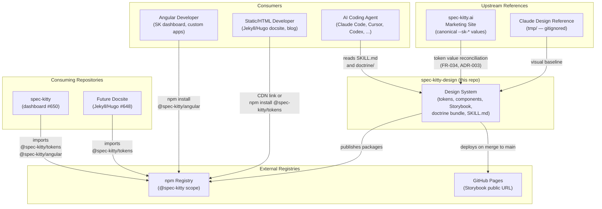
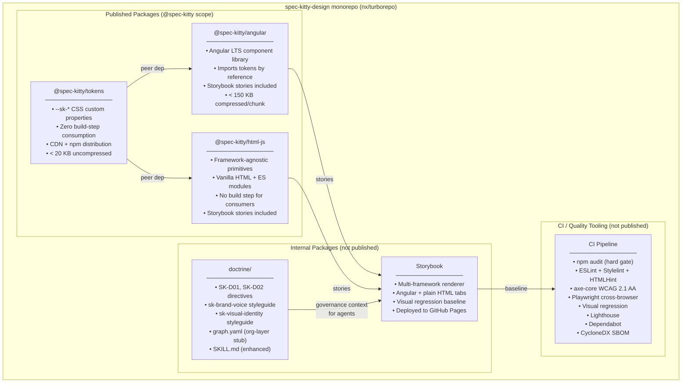

# Software Architecture Document (Lite): Spec Kitty Design System

| Field | Value |
|---|---|
| **Status** | Accepted |
| **Date** | 2026-05-01 |
| **Owner** | Stijn Dejongh |
| **Version** | 1.0 |
| **Scope** | Repository-level architecture for `spec-kitty-design` |
| **Related ADRs** | ADR-001 through ADR-005 |
| **Related spec** | `kitty-specs/design-system-monorepo-infra-ci-scaffold-01KQHEEJ/spec.md` |

---

## 1. Purpose and Scope

This document describes the architecture of the Spec Kitty Design System — a multi-framework, publishable design system for the Spec Kitty ecosystem and Priivacy-ai organisation. It covers system boundaries, package topology, bounded contexts, quality attributes, and the risk landscape at a level sufficient to guide implementation without prescribing implementation details.

**What this document is not:**
- An implementation guide (see `kitty-specs/` mission specs)
- A per-component specification (see Storybook once built)
- A live changelog (see `CHANGELOG.md` and ADRs)

**Architectural vision:** The design system is *token-first, framework-progressive*. The `@spec-kitty/tokens` CSS custom property layer is the long-lived, framework-agnostic foundation. Framework packages (Angular, and future targets) are short-lived lifecycle adapters that consume tokens by reference and add component ergonomics for a specific rendering environment. When a framework ages out, only its adapter package changes — the token layer is untouched.

---

## 2. C4 Level 1: System Context

### Actor and system roles

| Entity | Role |
|---|---|
| Angular Developer | Imports `@spec-kitty/angular` and `@spec-kitty/tokens`; builds SK dashboard, custom apps |
| Static/HTML Developer | Links `@spec-kitty/tokens` via CDN or file; no build step required |
| AI Coding Agent | Reads `SKILL.md` and `doctrine/` artifacts to generate brand-compliant output |
| `@spec-kitty` npm scope | Package registry; single distribution channel for all publishable artifacts |
| GitHub Pages | Public Storybook hosting; auto-deployed on merge to `main` |
| Marketing site (`spec-kitty.ai`) | Source of canonical `--sk-*` token values; must be reconciled with Claude Design reference (FR-034) |
| Claude Design reference (`tmp/`) | Authoritative visual baseline for v1; gitignored; not distributed |
| `spec-kitty` repo | Primary downstream consumer; dashboard UI overhaul (#650) |
| Future docsite | Secondary downstream consumer; docsite refresh (#648) |

---

## 3. C4 Level 2: Package / Container View

### Package responsibilities

| Package | Responsibility | Consumers |
|---|---|---|
| `@spec-kitty/tokens` | Single source of truth for all `--sk-*` visual values; zero-build-step distribution | All other packages; any HTML/CSS surface |
| `@spec-kitty/angular` | Angular LTS components consuming token values by reference; includes Storybook stories | Angular applications (SK dashboard, custom) |
| `@spec-kitty/html-js` | Framework-agnostic HTML primitives and ES module utilities; vanilla markup only | Static HTML surfaces, Jekyll/Hugo themes, non-Angular JS projects |
| Storybook | Living documentation; visual regression CI surface; multi-framework renderer; deployed to GitHub Pages | Contributors, component consumers, CI |
| `doctrine/` | Brand voice + visual identity governance for AI agents; org-layer doctrine bundle; SKILL.md | AI agents working on any Priivacy-ai project |
| CI pipeline | Quality enforcement: CVE scan, linting, a11y, visual regression, cross-browser, Lighthouse, SBOM | Every PR and release |

### Dependency rules

1. `@spec-kitty/tokens` has **no** dependencies on other packages in this repo.
2. `@spec-kitty/angular` and `@spec-kitty/html-js` depend on `@spec-kitty/tokens` as a peer dependency only — they do **not** bundle token values.
3. No framework package depends on another framework package.
4. `doctrine/` is an independent directory with no npm dependency on any package.
5. Storybook is a development tool; it is **not** a dependency of any published package.

---

## 4. Bounded Contexts

### 4.1 Token Authority Context

**Purpose:** Own all `--sk-*` CSS custom property definitions. The single source of truth for every visual decision in the ecosystem.

**Inbound:** Token schema decisions (ADR-003); value reconciliation from marketing site CSS (FR-034)
**Outbound:** `@spec-kitty/tokens` npm package; CDN-hosted CSS file

**Invariant:** No token value is defined outside this context. All other contexts consume tokens by name reference, never by hardcoded value (C-003, C-009, SK-D01).

**Ubiquitous language:** design token, custom property, `--sk-*` namespace, token catalogue, semantic pair (surface + foreground)

---

### 4.2 Component Library Context

**Purpose:** Provide framework-specific component implementations that express the design language for their target rendering environment. Owns rendering ergonomics; does not own visual values.

**Sub-contexts:**
- **Angular Components** (`@spec-kitty/angular`) — targets Angular LTS; inherits Angular's 6-month LTS lifecycle
- **HTML/JS Primitives** (`@spec-kitty/html-js`) — framework-agnostic; no build step required for consumers

**Inbound:** Token authority context (token values); Storybook stories (documentation obligation)
**Outbound:** Published npm packages per framework target

**Invariant:** Components render visual state using `--sk-*` tokens exclusively. Components do not override token values (ADR-001).

---

### 4.3 Documentation and Visual Regression Context

**Purpose:** Provide the authoritative public reference for design system consumers; serve as the CI visual regression surface.

**Inbound:** Stories from all component packages; token catalogue for "Getting Started" reference
**Outbound:** GitHub Pages public URL (auto-deployed on `main`); PR preview deployments (NFR-008); visual baseline snapshots for CI

**Dual-role tension:** The Storybook serves both consumers (reference documentation) and CI (regression baseline). These two roles require different freshness semantics — documentation reflects released content; regression reflects `HEAD`. This tension is acknowledged; resolution is deferred to CI configuration.

---

### 4.4 Doctrine Bundle Context

**Purpose:** Provide brand governance artifacts that AI agents load as governance context when working on any Priivacy-ai project.

**Inbound:** Brand voice rules and visual identity constraints (distilled from Claude Design reference README and `colors_and_type.css`)
**Outbound:** `doctrine/` directory (org-layer source for spec-kitty #832 `fetch`); enhanced `SKILL.md` (agent skill)

**Invariant:** Doctrine artifacts follow the spec-kitty shipped YAML schema and pass `charter synthesize --dry-run` validation. Illustration content boundary (SK-D02) is encoded as a directive, not just prose.

---

### 4.5 Supply Chain and Release Context

**Purpose:** Ensure every artifact that leaves the repository is traceable, CVE-free, and provenance-attested.

**Key controls:** `npm audit --audit-level=high`, `npm ci --ignore-scripts`, Actions SHA pinning, `npm publish --provenance`, CycloneDX SBOM, Dependabot (FR-040–046, C-009)

**Residual risk acceptance:** Formally documented in ADR-005. Reviewed and accepted by maintainer 2026-05-01.

---

## 5. Quality Attributes

Assessed using the AMMERSE framework. Full analysis in [`quality-attribute-assessment.md`](quality-attribute-assessment.md).

| Attribute | Rating | Key factor |
|---|---|---|
| **Agile** (adaptability) | +0.5 | Additive framework targets; token layer stable across framework churn |
| **Minimal** (simplicity) | +0.3 | CSS custom properties are native browser tech; no build step for token consumers. Offset by monorepo tooling complexity |
| **Maintainable** | +0.6 | Clear package boundaries; semantic token naming; ADRs document all key decisions |
| **Environmental** (fit) | +0.7 | WCAG 2.1 AA hard gate; dark mode default; no emoji; matches existing marketing site token language |
| **Reachable** (feasibility) | +0.4 | Infrastructure-first scope limits v1 blast radius; token reconciliation (FR-034) is the highest-risk pre-gate |
| **Solvable** (problem fit) | +0.8 | Directly addresses documented pain (#338, #646, #650); token authority eliminates root cause of brand drift |
| **Extensible** | +0.7 | Additive package model; org-layer doctrine distribution forward-compatible with #832 |

---

## 6. Risk Landscape

Full risk register in [`risk-register.md`](risk-register.md). Top-5 prioritised risks:

| # | Risk | Impact | Likelihood | Primary mitigation |
|---|---|---|---|---|
| R01 | `@spec-kitty` npm scope not owned before publishing infrastructure is built | Critical | Medium | Pre-flight check before any release pipeline work (ADR-005) |
| R02 | Token reconciliation (FR-034) reveals significant drift between Claude Design reference and live marketing site | High | Medium | FR-034 is a pre-implementation gate; ADR-003 |
| R03 | Angular LTS rotation breaks `@spec-kitty/angular` consumers mid-dependency window | High | Medium | Charter consumer update policy; 3-month pre-LTS-expiry upgrade initiation |
| R04 | CI pipeline exceeds 10-minute NFR-002 as component count grows | Medium | High | FR-035 path-scoped CI triggering from day one |
| R05 | Storybook major version upgrade breaks CI visual regression baseline | Medium | High | Storybook pinned; Dependabot major bumps excluded from auto-merge |

---

## 7. Architectural Decision Index

| ADR | Decision | Status |
|---|---|---|
| [ADR-001](decisions/2026-05-01-1-token-distribution-format.md) | CSS custom properties over Tailwind/shadcn | Accepted |
| [ADR-002](decisions/2026-05-01-2-monorepo-package-topology.md) | Separate publishable packages per framework target | Accepted |
| [ADR-003](decisions/2026-05-01-3-token-schema-naming-convention.md) | `--sk-<category>-<name>` schema; value reconciliation is a pre-implementation gate | Accepted |
| [ADR-004](decisions/2026-05-01-4-org-layer-doctrine-distribution.md) | `doctrine/` as org-layer source for #832 | Accepted |
| [ADR-005](decisions/2026-05-01-5-npm-supply-chain-security-posture.md) | npm security posture; residual risk explicitly accepted | Accepted |

---

## 8. Key Constraints Reference

Constraints that have significant architectural consequence (full list in mission spec):

| Constraint | Implication |
|---|---|
| C-003 / C-009: no hardcoded values; no `*`/`latest` specifiers | Token authority rule is enforceable by linting; every value traces to `@spec-kitty/tokens` |
| C-007: Angular targets current LTS | `@spec-kitty/angular` has an explicit maintenance lifecycle; must be tracked |
| C-008: illustrations excluded from software packages | Enforced as SK-D02 directive; CI must gate on presence of illustration assets in distribution output |
| FR-034 pre-implementation gate | No token package implementation begins before token schema ADR value reconciliation is complete |
| ADR-005 pre-flight: scope ownership | `@spec-kitty` npm scope must be confirmed owned before any publishing CI work |

---

## 9. Open Questions

| Question | Owner | Status |
|---|---|---|
| Which monorepo orchestrator: nx or turborepo? | Maintainer | Deferred to planning |
| PR preview deployment tooling: Chromatic vs Netlify vs Surge? | Maintainer | Deferred to planning (NFR-008 acknowledged) |
| Token value reconciliation result: how many discrepancies between `tmp/` and live site? | Maintainer | Pre-implementation gate; FR-034 |
| OKLCH vs hex/hsl for token values? | Maintainer | Deferred to ADR-003 addendum |
| `@spec-kitty` npm scope: owned/available? | Maintainer | Pre-flight check; blocks release pipeline work |
