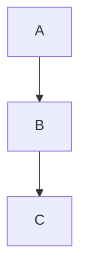
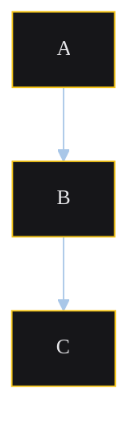

# Contract: Brand-theme source (`sk-mermaid-theme.yaml`)

**Mission**: `catalog-completeness-and-brand-consistency-01KQPDB5`
**Sources**: spec FR-013; research PLAN-004

This contract defines the schema and injection behaviour of the single shared brand-theme source file.

## File location

- Path: `docs/architecture/assets/sk-mermaid-theme.yaml`
- Single source of truth for every architecture diagram's branding (colours, fonts, backgrounds, edge label styling).

## Schema

```yaml
# sk-mermaid-theme.yaml
# Single source of truth for Mermaid diagram branding across docs/architecture/assets/.
# A change to any value here must be followed by `node scripts/render-diagrams.js`
# to regenerate every dependent SVG, otherwise CI rejects the PR.

theme: base                                   # Mermaid base theme (required by Mermaid)
themeVariables:
  fontFamily: "ui-sans-serif, system-ui, sans-serif"
  fontSize: "14px"
  primaryColor: "#161619"                     # Node fill (sk-surface-page equivalent)
  primaryTextColor: "#e8e8eb"                 # Node text (sk-on-page equivalent)
  primaryBorderColor: "#F5C518"               # Node border (sk-color-yellow)
  lineColor: "#A9C7E8"                        # Edge line colour
  secondaryColor: "#1C1C20"                   # Secondary node fill (sk-surface-card equivalent)
  tertiaryColor: "#0A0A0B"                    # Tertiary node fill
  edgeLabelBackground: "#1C1C20"              # Edge label background
  clusterBkg: "#1C1C20"                       # Subgraph background
  clusterBorder: "#26262C"                    # Subgraph border
```

### Field requirements

- `theme`: REQUIRED. Mermaid's base theme name (typically `base`).
- `themeVariables`: REQUIRED. Map of Mermaid's documented theme variable names to colour / font values.
- All colour values: REQUIRED to be hex (`#RRGGBB` or `#RGB`) or `rgba(…)`. They mirror values from `packages/tokens/src/tokens.css`. Mermaid does not consume CSS custom properties, so values are duplicated here intentionally — PLAN-004 acknowledges this duplication and the diagram-CI gate is the safety net.

### Future direction (out of scope for this mission)

Once ADR-003 token values are reconciled (FR-034 in the upstream tokens charter line), this YAML's values SHOULD be auto-derived from the token catalogue rather than duplicated. That migration is **out of scope** for this mission.

## Injection contract — `%%THEME%%` placeholder

Every `*.mmd` file under `docs/architecture/assets/` MUST start with the `%%THEME%%` placeholder on its own line, followed by a blank line, followed by the diagram body:



The render script (`scripts/render-diagrams.js`) replaces `%%THEME%%` with an inline Mermaid `%%{init}%%` block built from `sk-mermaid-theme.yaml`:



The compiled file is written to a temp directory (e.g., `tmp/diagrams/`), passed to `mmdc`, and then deleted. Source `.mmd` files in the repo retain only the `%%THEME%%` placeholder — they NEVER contain inline `%%{init}%%` blocks.

## Source-file invariants

For every `*.mmd` file in `docs/architecture/assets/`, after this mission ships:

1. The file MUST contain exactly one `%%THEME%%` line, on its own line, before any diagram syntax.
2. The file MUST NOT contain an inline `%%{init}%%` block (the render script provides one).
3. PR diffs on the source files show ONLY structural diagram changes — the theme block does not appear in any source diff.

## Validation contract

The render script MUST refuse to compile (non-zero exit) when:

- A `*.mmd` source file is missing the `%%THEME%%` placeholder.
- A `*.mmd` source file contains an inline `%%{init}%%` block (would conflict with the injected one).
- `sk-mermaid-theme.yaml` is malformed YAML.
- `sk-mermaid-theme.yaml` is missing the `theme` or `themeVariables` keys.

Each validation failure produces a clear stderr message naming the file and the rule violated.

## What this contract does NOT prescribe

- The exact set of theme variables in the YAML — Mermaid's vocabulary is the boundary; the values shown above are the initial migration values.
- The temp-directory location used by the render script — implementation choice (`tmp/diagrams/` is suggested; gitignored under existing `tmp/` rule).
- The exact stderr message wording for validation failures — implementation choice, as long as the file and rule are identifiable.
